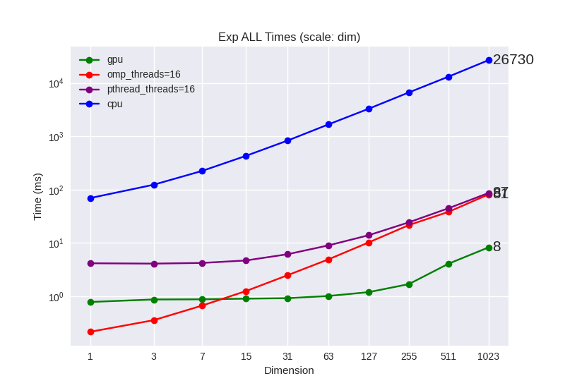
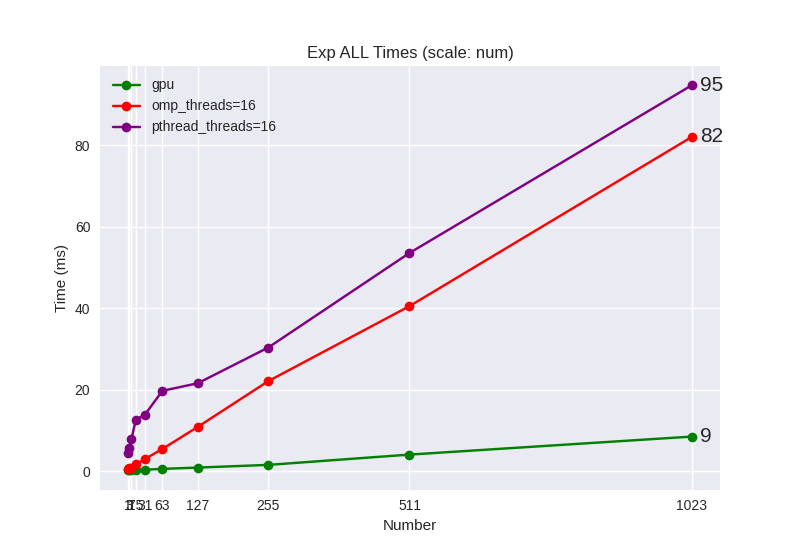

# Parallel implementations of the Particle Swarm Optimization (PSO) algorithm

We implement the PSO algorithm with numpy and parallelize it with `pthread`, `OpenMP` & `CUDA C++` combined with [pybind11](https://github.com/pybind/pybind11).

### Levy function:


### Rastrigin function:


### Rosenbrock function:


## Usage

### Clone this repo

```bash
git clone https://github.com/312581032TsaiBauChi/Parallel-Particle-Swarm-Optimization.git
cd Parallel-Particle-Swarm-Optimization
```

### Build packages

```bash
mkdir build
cd build
cmake ..
make -j4
cd ..
```

### Make animations

```bash
make cpu      # Make CPU impl animation
make gpu      # Make GPU impl animation
make omp      # Make OpenMP impl animation
make pthread  # Make pthread impl animation
```

### Test performances

* Scaling space dimensions :
```bash
make perf_number c="-n Test -t dim -d cpu"      # test CPU impl performance
make perf_number c="-n Test -t dim -d gpu"      # test GPU impl performance
make perf_number c="-n Test -t dim -d omp"      # test OpenMP impl performance
make perf_number c="-n Test -t dim -d pthread"  # test pthread impl performance

make plot_number c="-n Test -t dim -d every"                      # plot curves of all impls with out CPU one.
make plot_number c="-n Test -t dim -d every --logx --logy --cpu"  # plot curves of all impls in log-scale.
```

* Scaling number of particles :
```bash
make perf_number c="-n Test -t num -d cpu"      # test CPU impl performance
make perf_number c="-n Test -t num -d gpu"      # test GPU impl performance
make perf_number c="-n Test -t num -d omp"      # test OpenMP impl performance
make perf_number c="-n Test -t num -d pthread"  # test pthread impl performance

make plot_number c="-n Test -t num -d every"                      # plot curves of all impls with out CPU one.
make plot_number c="-n Test -t num -d every --logx --logy --cpu"  # plot curves of all impls in log-scale.
```

* Scaling number of threads of OpenMP and pthread :
```bash
make perf_scale c="-n Test -d omp"      # test OpenMP impl performance
make perf_scale c="-n Test -d pthread"  # test OpenMP impl performance

make plot_scale c="-n Test -d omp"      # plot curves of OpenMP impl
make plot_scale c="-n Test -d pthread"  # plot curves of pthread impl
```

* CUDA Experiments : 

1. Adjust the definitions of `BLOCK_DIM_X` and `BLOCK_DIM_Y` in `./csrc/cuPSO/utils/include/utils.cuh` (line 8 & 9).

```cpp
#define BLOCK_DIM_X 1L    // related to the number of particles
#define BLOCK_DIM_Y 256L  // related to the space dimensions
```

2. Recompile the project. (see [Build packages](#build-packages))

3. Run the testing code.

```bash
make perf_cuda
```

## Experiments

> Note that we only use `Levy Function` to do our experiments on parallelization !

> You will see that the CPU implementation takes significantly more time to execute, as the serial version is implemented purely in Python.

### Scaling space dimensions

* space dimension = 2^i - 1, for i=[1, 2, ..., 10]
* number of particles = 3000
* PSO iterations = 10

Linear-scale x & y axes (without CPU data) : 


Log-scale x & y axes :



The leftmost part of the figures above is more affected by the `overhead` of each device or framework. When there are a large number of particles in a low-dimensional space, the PSO algorithm converges quickly, reducing the frequency of local and global best updates.

## Scaling number of particles

* space dimension = 3000
* number of particles = 2^i - 1, for i=[1, 2, ..., 10]
* PSO iterations = 10

Linear-scale x & y axes (without CPU data) :



Log-scale x & y axes :


The overhead issue is not obvious here because there are only few particles in a high-dimensional space, which means we need a large number of iterations to let the PSO converge.

## Scaling number of threads

* space dimension = 2^i - 1, for i=[1, 2, ..., 10]
* number of particles = space dimension * 2^5
* PSO iterations = 10

### OpemMP

Log-scale x & y axes :


### Pthread

Log-scale x & y axes :


We can see that the overhead of pthread for launching threads is higher than OpenMP.


## CUDA Experiments

Adjust the shape of the thread blocks and observe the performance differences.

* space dimension = 1024 
* number of particles = 1024 
* PSO iterations = 1000

| Block Shape | Exec Time (s) |
|  ----  | ----  |
| 256*1  |  0.4054610601005455 |
| 128*2  |  0.38019075666864716 |
| 64*4   |  0.3638322894771894 |
| 32*8   |  0.3968619456825157 |
| 16*16  |  0.30794164454564454 |
| 8*32   |  0.24697648656244078 |
| 4*64   |  0.2032000591357549 |
| 2*128  |  0.1980450333406528 |
| 1*256  |  0.19917888169487316 |

According to the table above, we can see that when block shape = (1, 256) or (2, 128), the cuPSO gets the best performance. This is due to the `memory coalescing` technique.

| Block Shape | Exec Time (s) |
|  ----  | ----  |
| 1*4    |  0.8009999251924456 |
| 1*8    |  0.569435287763675 |
| 1*16   |  0.33047667148833476 |
| 1*32   |  0.22315609737609823 |
| 1*64   |  0.2076006976266702 |
| 1*128  |  0.19953426771486799 |
| 1*256  |  0.19917888169487316 |
| 1*512  |  0.20139076318591834 |
| 1*1024 |  0.21060395787159603 |

The fewer threads in the blocks, the lower the performance achieved by the algorithm due to the memory coalescing (and perhapes the parallelism) issue(s). But when using too much threads in the blocks, there are no enough local memory & register resources in the stream-multiprocessors (SMs).